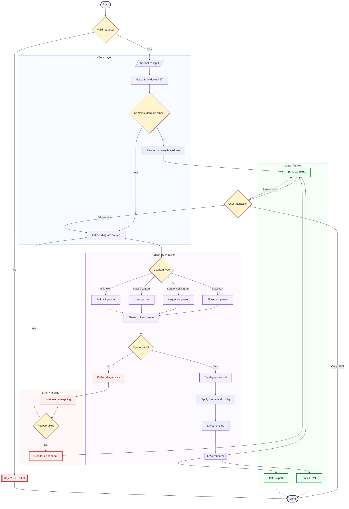

import TestComponent from "../components/TestComponent";
import Callout from "../components/Callout";
import CodePreview from "../components/CodePreview";

export const postVersion = "1.0.0";

# Complete MDX CMS Test Post

This document is designed to test a wide range of **Markdown**, **MDX**, JSX, code-highlighting, and content-management features.

> Use this post as a fixture when validating a CMS editor, MDX compiler, syntax highlighter, design system, or content rendering pipeline.

---

## Table of contents

- [Text formatting](#text-formatting)
- [Headings](#headings)
- [Links](#links)
- [Lists](#lists)
- [Blockquotes](#blockquotes)
- [Code](#code)
- [Tables](#tables)
- [Images](#images)
- [Horizontal rules](#horizontal-rules)
- [Escaping and special characters](#escaping-and-special-characters)
- [HTML](#html)
- [JSX and components](#jsx-and-components)
- [Footnotes](#footnotes)
- [Task lists](#task-lists)
- [Math](#math)
- [Long-form content](#long-form-content)
- [Edge cases](#edge-cases)

---

## Text formatting

This is a normal paragraph.

This text is **bold**.

This text is **also bold**.

This text is _italic_.

This text is _also italic_.

This text is **_bold and italic_**.

This text is **_also bold and italic_**.

This text is ~~strikethrough~~.

This sentence contains `inline code`.

This text contains a <mark>highlighted section</mark> using HTML.

This sentence contains an abbreviation: <abbr title="JavaScript Object Notation">JSON</abbr>.

This is keyboard input: <kbd>Ctrl</kbd> + <kbd>K</kbd>.

This is a variable: <var>userId</var>.

This is sample output: <samp>Hello, world!</samp>.

This is small text: <small>Additional legal or supporting information.</small>

This line uses a manual line break.
The second line should appear directly below it.

Text before a superscript<sup>2</sup> and text before a subscript<sub>n</sub>.

---

## Headings

# Heading level 1

## Heading level 2

### Heading level 3

#### Heading level 4

##### Heading level 5

###### Heading level 6

### Heading with `inline code`

### Heading with **bold text**

### Heading with punctuation: commas, periods, and symbols!

### Repeated heading

Content below the first repeated heading.

### Repeated heading

Content below the second repeated heading. The generated heading ID should not conflict with the first one.

### Héading with àccénted characters

### 日本語の見出し

### Heading with an emoji 🚀

---

## Links

This is an [internal link](/about).

This is an [external link](https://example.com).

This is an [external link with a title](https://example.com "Example website").

This is an automatic URL: https://example.com.

This is an automatic email address: [hello@example.com](mailto:hello@example.com).

This is a reference-style [link][example-reference].

[example-reference]: https://example.com "Reference-style link"

This is a relative link to [another post](./another-post).

This is an anchor link to the [code section](#code).

This link contains formatting: [**bold link text**](https://example.com).

---

## Lists

### Unordered list

- First item
- Second item
- Third item

### Alternative unordered markers

- Item using an asterisk
- Another item
- Final item

* Item using a plus sign
* Another item
* Final item

### Ordered list

1. First item
2. Second item
3. Third item

### Ordered list with a custom starting number

5. Fifth item
6. Sixth item
7. Seventh item

### Nested unordered list

- Parent item

  - Child item

    - Grandchild item

      - Great-grandchild item

- Second parent item

### Nested ordered list

1. First parent

   1. First child
   2. Second child

      1. Grandchild

2. Second parent

### Mixed nested list

1. Install dependencies

   - Use npm
   - Use pnpm
   - Use Yarn

2. Configure the project

   - Add environment variables
   - Create a configuration file

3. Run the application

   1. Start the development server
   2. Open the browser
   3. Verify the page

### List items containing multiple blocks

- First paragraph in a list item.

  Second paragraph in the same list item.

- List item containing a blockquote:

  > This blockquote is nested inside a list.

- List item containing code:

  ```js
  const insideAList = true;
  ```

---

## Blockquotes

> This is a simple blockquote.

> This blockquote contains **bold text**, _italic text_, and `inline code`.

> This is a multiline blockquote.
>
> It contains multiple paragraphs.
>
> - It can also contain a list.
> - Here is another list item.

### Nested blockquotes

> Outer blockquote
>
> > Nested blockquote
> >
> > > Deeply nested blockquote

### Blockquote containing code

> Example:
>
> ```ts
> const message: string = "Code inside a blockquote";
> ```

---

## Code

### Inline code

Use `npm run dev` to start the development server.

An inline code sample containing punctuation: `const value = foo?.bar ?? "default"`.

An inline code sample containing a backtick: ``const symbol = "`"``.

### Plain code block

```
This code block does not specify a language.
It should render without syntax highlighting.
```

### JavaScript

```javascript
const users = [
  { id: 1, name: "Ada Lovelace", active: true },
  { id: 2, name: "Grace Hopper", active: false },
];

const activeUsers = users.filter((user) => user.active);

console.log(activeUsers);
```

### JavaScript with short language identifier

```js
export function greet(name = "World") {
  return `Hello, ${name}!`;
}

console.log(greet("MDX"));
```

### TypeScript

```typescript
interface User {
  id: number;
  name: string;
  email?: string;
  roles: Array<"admin" | "editor" | "viewer">;
}

function getDisplayName(user: User): string {
  return user.name.trim() || `User ${user.id}`;
}

const user: User = {
  id: 42,
  name: "Ada Lovelace",
  roles: ["admin", "editor"],
};
```

### TSX

```tsx
type ButtonProps = {
  children: React.ReactNode;
  variant?: "primary" | "secondary";
  disabled?: boolean;
};

export function Button({ children, variant = "primary", disabled = false }: ButtonProps) {
  return (
    <button type="button" className={`button button--${variant}`} disabled={disabled}>
      {children}
    </button>
  );
}
```

### JSX

```jsx
export default function WelcomeCard({ name }) {
  return (
    <section className="welcome-card">
      <h2>Hello, {name}!</h2>
      <p>Welcome to the MDX test page.</p>
    </section>
  );
}
```

### HTML

```html
<!doctype html>
<html lang="en">
  <head>
    <meta charset="UTF-8" />
    <meta name="viewport" content="width=device-width, initial-scale=1.0" />
    <title>MDX Test</title>
  </head>
  <body>
    <main>
      <h1>Hello, HTML!</h1>
    </main>
  </body>
</html>
```

### CSS

```css
:root {
  --content-width: 72rem;
  --space-unit: 0.25rem;
}

.article {
  width: min(100% - 2rem, var(--content-width));
  margin-inline: auto;
}

.article :is(h2, h3) {
  scroll-margin-top: 6rem;
}

@media (prefers-color-scheme: dark) {
  body {
    background: #111;
    color: #f5f5f5;
  }
}
```

### SCSS

```scss
$breakpoint: 48rem;

.card {
  padding: 1rem;
  border: 1px solid currentColor;

  &__title {
    margin-block: 0 0.5rem;
  }

  @media (min-width: $breakpoint) {
    padding: 2rem;
  }
}
```

### JSON

```json
{
  "name": "mdx-cms-test",
  "version": "1.0.0",
  "private": true,
  "features": {
    "markdown": true,
    "jsx": true,
    "syntaxHighlighting": true
  }
}
```

### JSON with comments

```jsonc
{
  // This file supports comments.
  "compilerOptions": {
    "strict": true,
    "jsx": "preserve",
  },
}
```

### YAML

```yaml
name: MDX Test Workflow

on:
  push:
    branches:
      - main

jobs:
  test:
    runs-on: ubuntu-latest
    steps:
      - uses: actions/checkout@v4
      - run: npm install
      - run: npm test
```

### TOML

```toml
title = "MDX Test"

[author]
name = "Test Author"
email = "author@example.com"

[features]
markdown = true
jsx = true
```

### Bash

```bash
#!/usr/bin/env bash

set -euo pipefail

npm install
npm run lint
npm run test
npm run build
```

### Shell session

```console
$ npm install
added 248 packages in 4s

$ npm run dev
> app@1.0.0 dev
> next dev
```

### Python

```python
from dataclasses import dataclass


@dataclass
class User:
    id: int
    name: str
    active: bool = True


def active_names(users: list[User]) -> list[str]:
    return [user.name for user in users if user.active]


users = [
    User(id=1, name="Ada"),
    User(id=2, name="Grace", active=False),
]

print(active_names(users))
```

### Ruby

```ruby
class Greeting
  def initialize(name)
    @name = name
  end

  def call
    "Hello, #{@name}!"
  end
end

puts Greeting.new("MDX").call
```

### PHP

```php
<?php

declare(strict_types=1);

function greet(string $name = 'World'): string
{
    return sprintf('Hello, %s!', $name);
}

echo greet('MDX');
```

### Java

```java
public final class Main {
    public static void main(String[] args) {
        String name = args.length > 0 ? args[0] : "World";
        System.out.printf("Hello, %s!%n", name);
    }
}
```

### C#

```csharp
public record User(int Id, string Name, bool Active);

var users = new[]
{
    new User(1, "Ada", true),
    new User(2, "Grace", false),
};

var activeUsers = users.Where(user => user.Active);

foreach (var user in activeUsers)
{
    Console.WriteLine(user.Name);
}
```

### C

```c
#include <stdio.h>

int main(void) {
    const char *message = "Hello, MDX!";
    printf("%s\n", message);
    return 0;
}
```

### C++

```cpp
#include <iostream>
#include <string>
#include <vector>

int main() {
    std::vector<std::string> names{"Ada", "Grace", "Linus"};

    for (const auto& name : names) {
        std::cout << "Hello, " << name << "!\n";
    }

    return 0;
}
```

### Go

```go
package main

import "fmt"

type User struct {
	ID     int
	Name   string
	Active bool
}

func main() {
	user := User{
		ID:     1,
		Name:   "Ada",
		Active: true,
	}

	fmt.Printf("%+v\n", user)
}
```

### Rust

```rust
#[derive(Debug)]
struct User {
    id: u32,
    name: String,
    active: bool,
}

fn main() {
    let user = User {
        id: 1,
        name: String::from("Ada"),
        active: true,
    };

    println!("{user:#?}");
}
```

### SQL

```sql
SELECT
    users.id,
    users.name,
    COUNT(posts.id) AS post_count
FROM users
LEFT JOIN posts
    ON posts.user_id = users.id
WHERE users.active = TRUE
GROUP BY users.id, users.name
HAVING COUNT(posts.id) >= 1
ORDER BY post_count DESC;
```

### GraphQL

```graphql
query GetPost($slug: String!) {
  post(slug: $slug) {
    id
    title
    description
    author {
      name
      avatarUrl
    }
    tags {
      id
      name
    }
  }
}
```

### Markdown source

```markdown
# Example Markdown

This is **bold**, this is _italic_, and this is `inline code`.

- First item
- Second item

> A blockquote
```

### MDX source

```mdx
import Callout from "./Callout";

# Example MDX

<Callout type="info">This content is rendered through a React component.</Callout>
```

### Diff

```diff
- const framework = "Markdown"
+ const framework = "MDX"

- console.log("Plain text")
+ console.log(<Component />)
```

### Code filename metadata

```ts title="src/lib/greeting.ts"
export function greeting(name: string): string {
  return `Hello, ${name}!`;
}
```

### Highlighted lines metadata

```ts {2,5-7}
export function calculateTotal(values: number[]) {
  const subtotal = values.reduce((sum, value) => sum + value, 0);

  const taxRate = 0.2;
  const tax = subtotal * taxRate;
  const total = subtotal + tax;
  return total;
}
```

### Highlighted words metadata

```js /activeUsers/
const users = getUsers();
const activeUsers = users.filter((user) => user.active);
console.log(activeUsers);
```

### Line numbers metadata

```js showLineNumbers
function fibonacci(count) {
  const values = [0, 1];

  for (let index = 2; index < count; index += 1) {
    values.push(values[index - 1] + values[index - 2]);
  }

  return values.slice(0, count);
}
```

### Combined code metadata

```tsx title="components/Alert.tsx" showLineNumbers {8-10}
type AlertProps = {
  children: React.ReactNode;
  type?: "info" | "warning" | "error";
};

export function Alert({ children, type = "info" }: AlertProps) {
  return (
    <div role="alert" data-alert-type={type}>
      {children}
    </div>
  );
}
```

### Very long code line

```js
const extremelyLongValue =
  "This deliberately long line tests horizontal scrolling, overflow handling, copy buttons, and whether a code block expands beyond the width of its content container without breaking the layout.";
```

### Empty code block

```text

```

---

## Tables

### Basic table

| Name         | Role          | Active |
| ------------ | ------------- | ------ |
| Ada Lovelace | Engineer      | Yes    |
| Grace Hopper | Scientist     | Yes    |
| Alan Turing  | Mathematician | No     |

### Column alignment

| Left aligned | Center aligned | Right aligned |
| :----------- | :------------: | ------------: |
| Left         |     Center     |           100 |
| Text         |     Value      |         2,500 |
| Another row  |     Middle     |            42 |

### Formatting inside tables

| Feature       | Example                        | Supported |
| ------------- | ------------------------------ | --------- |
| Bold          | **Bold text**                  | Yes       |
| Italic        | _Italic text_                  | Yes       |
| Inline code   | `const value = 1`              | Yes       |
| Link          | [Example](https://example.com) | Yes       |
| Strikethrough | ~~Removed~~                    | Maybe     |

### Escaped pipe inside a table

| Expression          | Meaning                  |
| ------------------- | ------------------------ |
| `a \| b`            | A literal pipe character |
| `value ?? fallback` | Nullish coalescing       |

### Wide table

|  ID | Name         | Email                                         | Role          | Status   | Created    | Updated    | Notes             |
| --: | ------------ | --------------------------------------------- | ------------- | -------- | ---------- | ---------- | ----------------- |
|   1 | Ada Lovelace | [ada@example.com](mailto:ada@example.com)     | Administrator | Active   | 2026-01-01 | 2026-07-15 | First test user   |
|   2 | Grace Hopper | [grace@example.com](mailto:grace@example.com) | Editor        | Active   | 2026-02-01 | 2026-07-14 | Tests wide tables |
|   3 | Alan Turing  | [alan@example.com](mailto:alan@example.com)   | Viewer        | Inactive | 2026-03-01 | 2026-07-13 | Tests overflow    |

---

## Images

### Basic image


### Image with a title


### Linked image

[](https://example.com)

### HTML image with dimensions


### Figure and caption

<figure>
  
  <figcaption>Figure 1: A sample image with a semantic caption.</figcaption>
</figure>

### Missing-image test


---

## Horizontal rules

Content before a horizontal rule.

---

Content between horizontal rules.

---

More content between horizontal rules.

---

Content after the final horizontal rule.

---

## Escaping and special characters

Escaped Markdown characters:

_not italic_

**not bold**

# not a heading

- not a list item

> not a blockquote

`not inline code`

Literal braces in MDX may need escaping or expressions:

{"{"}example{"}"}

Literal angle brackets:

<example>

Ampersand:

AT&T

Copyright symbol:

© 2026

Registered trademark:

®

Non-breaking space between these words: first second.

Common punctuation:

“Smart quotes,” ‘single quotes,’ em dash —, en dash –, ellipsis …, and apostrophe ’.

Currency:

$10, €20, £30, ¥40, ₫50,000.

Mathematical symbols:

± × ÷ ≠ ≤ ≥ ∞ √ π.

Arrows:

← → ↑ ↓ ↔ ⇒.

Emoji:

😀 🎉 🚀 ✅ ⚠️ ❌ ❤️ 🧪 🧑‍💻

Non-Latin text:

- Vietnamese: Xin chào thế giới.
- Japanese: こんにちは世界。
- Korean: 안녕하세요 세계.
- Arabic: مرحبًا بالعالم.
- Hebrew: שלום עולם.
- Hindi: नमस्ते दुनिया।
- Chinese: 你好，世界。
- Cyrillic: Привет, мир.
- Greek: Γεια σου κόσμε.

---

## HTML

<div className="custom-html-block">
  <p>This paragraph is inside a raw HTML-style MDX block.</p>
</div>

<details>
  <summary>Expandable details section</summary>

This content should be hidden until the details element is opened.

- It contains Markdown.
- It contains `inline code`.
- It contains **formatted text**.

</details>

<aside aria-label="Supporting information">
  This content is inside a semantic <code>aside</code> element.
</aside>

<section aria-labelledby="custom-section-heading">
  <h3 id="custom-section-heading">Custom HTML section</h3>
  <p>This section uses explicit HTML elements.</p>
</section>

<dl>
  <dt>MDX</dt>
  <dd>Markdown combined with JSX.</dd>

  <dt>CMS</dt>
  <dd>A content management system.</dd>
</dl>

<progress value="70" max="100">
  70%
</progress>

<meter min="0" max="100" low="30" high="80" optimum="100" value="85">
  85 out of 100
</meter>

---

## JSX and components

### Basic component

<TestComponent />

### Component with string props

<TestComponent title="Component title" description="A component rendered directly from MDX." />

### Component with expression props

<TestComponent count={3} active={true} disabled={false} items={["one", "two", "three"]} />

### Component with an object prop

<TestComponent
  user={{
    id: 1,
    name: "Ada Lovelace",
    role: "admin",
  }}
/>

### Component with children

<TestComponent title="Component with children">
  This content is passed to the component as **children**.

It can contain multiple paragraphs and `inline code`. </TestComponent>

### Nested components

<TestComponent title="Outer component">
  <TestComponent title="Inner component">Content inside a nested component.</TestComponent>
</TestComponent>

### Custom callouts

<Callout type="info" title="Information">
  This is an informational callout.
</Callout>

<Callout type="success" title="Success">
  The MDX component rendered successfully.
</Callout>

<Callout type="warning" title="Warning">
  Make sure your CMS allows the components used in this document.
</Callout>

<Callout type="error" title="Error">
  Unknown components should produce a clear error or fallback.
</Callout>

### JavaScript expression

The exported post version is **{postVersion}**.

The result of a JavaScript expression is **{2 + 2}**.

The current test status is **{"passing".toUpperCase()}**.

### Conditional rendering

{true ? (

  <p>This paragraph should be rendered.</p>
) : (
  <p>This paragraph should not be rendered.</p>
)}

### Array rendering

<ul>
  {["Markdown", "JSX", "Components"].map((item) => (
    <li key={item}>{item}</li>
  ))}
</ul>

### JSX fragment

<>

  <p>This paragraph is inside a fragment.</p>
  <p>This is another fragment child.</p>
</>

### Component containing a code block

<CodePreview title="Example component source" language="tsx">
  {`export function Example() {
  return <p>Hello from a code preview.</p>
}`}
</CodePreview>

### Custom HTML attributes

<div
  id="custom-attribute-test"
  className="test-class"
  data-testid="mdx-test"
  data-status="active"
  aria-label="Custom attribute example"
  tabIndex={0}
>
  This element tests standard, data, and ARIA attributes.
</div>

---

## Footnotes

Here is a sentence with a footnote.[^1]

Here is another sentence with a longer footnote.[^long-note]

Footnotes may also be reused.[^shared]

Another reference to the shared footnote.[^shared]

[^1]: This is a basic footnote.

[^long-note]: This is a longer footnote containing multiple sentences. It tests spacing, backlink rendering, and footnote typography.

[^shared]: This footnote is referenced more than once.

---

## Task lists

- [x] Parse frontmatter
- [x] Render Markdown
- [x] Render JSX components
- [ ] Validate all code themes
- [ ] Check responsive tables
- [ ] Check print styles

### Nested task list

- [x] Content

  - [x] Headings
  - [x] Paragraphs
  - [ ] Custom typography

- [ ] Media

  - [x] Images
  - [ ] Video embeds
  - [ ] Audio embeds

---

## Math

Inline math using common remark-math syntax:

The mass-energy equivalence formula is $E = mc^2$.

A more complex inline expression is $\sum_{i=1}^{n} i = \frac{n(n+1)}{2}$.

Block math:

$$
f(x) = x^2 + 2x + 1
$$

A matrix:

$$
A =
\begin{bmatrix}
1 & 2 \
3 & 4
\end{bmatrix}
$$

A longer equation:

$$
\int_{-\infty}^{\infty} e^{-x^2},dx = \sqrt{\pi}
$$

> Math rendering requires a compatible plugin such as `remark-math` and a renderer such as KaTeX.

---

## Long-form content

Lorem ipsum dolor sit amet, consectetur adipiscing elit. Integer facilisis, risus vitae posuere tincidunt, arcu sapien suscipit nibh, quis malesuada erat augue eget sem. Curabitur vel velit id augue malesuada elementum. Suspendisse potenti. Nulla facilisi. Praesent malesuada, lorem non feugiat tempor, lacus sem luctus lacus, vitae bibendum justo nibh vitae lectus.

Aliquam erat volutpat. Integer ultrices mauris quis ipsum gravida, sit amet placerat elit tristique. Sed vulputate sem sed eros facilisis, at aliquet justo aliquam. Donec at posuere sem. Vestibulum ante ipsum primis in faucibus orci luctus et ultrices posuere cubilia curae; Donec vulputate, lorem eget aliquet posuere, elit dolor volutpat justo, vitae sodales neque urna in ipsum.

### Long paragraph test

This deliberately long paragraph tests readable line length, wrapping behavior, responsive typography, widows, orphans, links inside dense prose, and the interaction between inline formatting elements. A content layout should keep this paragraph readable on both narrow and wide screens while preserving sufficient contrast, comfortable line height, and sensible spacing. It also contains **bold text**, _italic text_, `inline code`, a [link](https://example.com), ~~strikethrough text~~, and an abbreviation such as <abbr title="Cascading Style Sheets">CSS</abbr> to make sure mixed inline content does not disrupt the baseline or line box.

---

## Edge cases

### Paragraph immediately after a heading

This paragraph should have the expected heading-to-paragraph spacing.

### Consecutive headings

#### First consecutive heading

##### Second consecutive heading

###### Third consecutive heading

### Empty-looking paragraph

 

### Single-character content

A

### Very long word

pneumonoultramicroscopicsilicovolcanoconiosis

### Long unbroken technical string

https://example.com/a/very/long/path/that/contains/no/convenient/breakpoints/and/tests/how-the-content-layout-handles-overflow-without-breaking-the-entire-page

### Repeated inline styles

**Bold text with _nested italic text_ and `inline code`.**

### Parentheses and brackets

A sentence with (parentheses), [square brackets], {"{"}curly braces{"}"}, and <angle brackets> represented as HTML-like syntax.

### Quotes inside code

```js
const single = 'A "double quote" inside single quotes';
const double = "A 'single quote' inside double quotes";
const template = `Both "double" and 'single' quotes`;
```

### JSX-like text in code

```text
<Component prop="value">
  This must remain text.
</Component>
```

### Markdown-like text in code

```text
# This must not become a heading

- This must not become a list

**This must not become bold**
```

### Comment syntax

{/* This is an MDX comment and should not appear in the rendered output. */}

Visible text appears after the hidden MDX comment.

### Adjacent JSX elements

<span>First span</span> <span>Second span</span> <span>Third span</span>

### Self-closing HTML elements

Line one.<br />
Line two.

A thematic break follows.

<hr />

### Potentially unsafe HTML

The following examples should be sanitized or blocked when content is untrusted:

```html
<script>
  alert("unsafe");
</script>

<iframe src="https://untrusted.example"></iframe>
```

Do not render untrusted MDX without an appropriate component allowlist, HTML sanitizer, or isolated rendering strategy.

---

## Embedded media examples

### Video

<video controls width="720" poster="/images/video-poster.jpg">
  <source src="/media/example-video.mp4" type="video/mp4" />
  Your browser does not support the video element.
</video>

### Audio

<audio controls>
  <source src="/media/example-audio.mp3" type="audio/mpeg" />
  Your browser does not support the audio element.
</audio>

### Responsive iframe

<div className="responsive-embed">
  <iframe
    src="https://example.com/embed"
    title="Example embedded content"
    loading="lazy"
    allowFullScreen
  />
</div>

---

## Accessibility test content

<button type="button" aria-label="Close notification">
  ×
</button>

<label htmlFor="test-email">Email address</label>
<input
  id="test-email"
  name="email"
  type="email"
  placeholder="name@example.com"
  autoComplete="email"
/>

<label htmlFor="test-message">Message</label>

<textarea id="test-message" name="message" rows={4} defaultValue="Default textarea content" />

<label htmlFor="test-select">Role</label>
<select id="test-select" name="role" defaultValue="editor">
  <option value="admin">Administrator</option>
  <option value="editor">Editor</option>
  <option value="viewer">Viewer</option>
</select>

---

## Final validation checklist

- [ ] Frontmatter is parsed correctly
- [ ] Imported components resolve correctly
- [ ] Exported values are available
- [ ] Heading IDs are generated correctly
- [ ] Duplicate headings receive unique IDs
- [ ] Internal and external links render correctly
- [ ] Nested lists align correctly
- [ ] Blockquotes support nested content
- [ ] Inline code is styled correctly
- [ ] Code blocks use syntax highlighting
- [ ] Code metadata is supported or ignored safely
- [ ] Long code lines scroll horizontally
- [ ] Tables are responsive
- [ ] Images preserve aspect ratio
- [ ] Missing images fail gracefully
- [ ] Raw HTML is handled according to policy
- [ ] Custom JSX components render correctly
- [ ] Unknown components produce a useful error
- [ ] Footnotes render with backlinks
- [ ] Task lists display checked states
- [ ] Math expressions render correctly
- [ ] Non-Latin text displays correctly
- [ ] RTL text is readable
- [ ] Long words do not break the layout
- [ ] Embedded media is responsive
- [ ] Unsafe HTML is sanitized or rejected
- [ ] Keyboard navigation works
- [ ] Focus states are visible
- [ ] The page is readable in light and dark themes
- [ ] Print styles remain usable

---

# Conclusion test test test test Conclusion test test test test Conclusion test test test test Conclusion test test test test Conclusion test test test test Conclusion test test test test Conclusion test test test test Conclusion test test test test Conclusion test test test test Conclusion test test test test

This is the end of the MDX CMS test document.

<TestComponent
  title="Test complete"
  description="If this component renders, the document reached its final section successfully."
  active={true}
/>

## Another one: Mermaid graph


